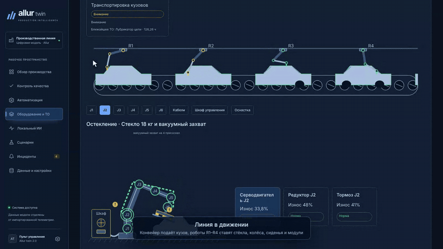
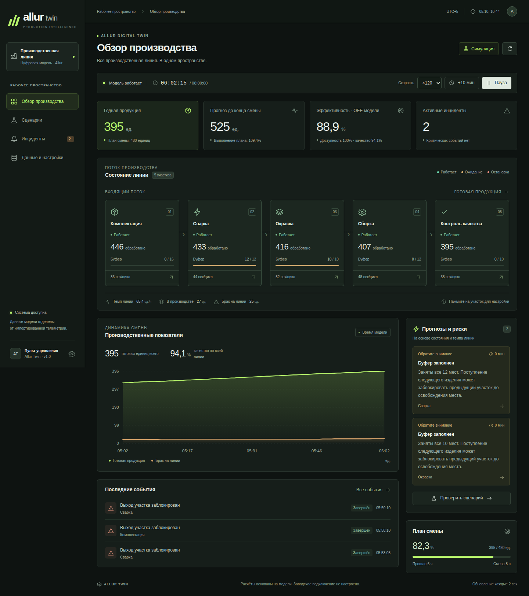

# Allur twin 2.0 — цифровой двойник производственной линии

Веб-приложение для сборочного производства: модель линии в реальном времени, автоматизация участков, роботы и конвейер
с датчиками и износом, плановое ТО и склад запчастей, сценарии «что если», журнал инцидентов и локальный ИИ-помощник.



**Посмотреть без установки:** [видео-демонстрация, 3 минуты](docs/media/allur-twin-demo.mp4)

## Как запустить на своём компьютере

Нужен бесплатный [Docker Desktop](https://www.docker.com/products/docker-desktop/) (Windows, macOS или Linux) и интернет при первом запуске.

1. Скачайте проект: зелёная кнопка **Code → Download ZIP**, распакуйте архив.
2. Запустите Docker Desktop и дождитесь статуса **Engine running**.
3. Дважды щёлкните файл запуска:
   - **Windows:** `start-windows.bat`
   - **macOS:** `start-mac.command` (если macOS не открывает файл: правый щелчок → «Открыть» → «Открыть»)
   - **Linux:** в терминале `sh start.sh`
4. Первая сборка занимает 3–7 минут. Затем браузер сам откроет **http://localhost:8088**, а окно запуска покажет логин `admin` и пароль.
   После первого входа приложение попросит задать свой пароль (от 15 символов).

Остановка: `stop-windows.bat`, `stop-mac.command` или `docker compose stop`. Данные сохраняются между запусками.

Что посмотреть в первую очередь:
- **Обзор производства** — нажмите «Запустить» (модель идёт в 30 раз быстрее реального времени) и «+10 мин».
- **Оборудование и ТО → Эмуляция** — линия с роботами R1–R4, кликабельные оси, датчики, износ и сценарии аварий.
- **Сценарии** — проверка решения на копии модели, действующая линия не меняется.
- **Инциденты**, **Контроль качества**, переключатель светлой и тёмной темы в правом верхнем углу.

## Онлайн-копия на Render (бесплатно)

[](https://render.com/deploy?repo=https://github.com/Kavkaz228/allur-twin)

Кнопка создаёт собственную копию демо в аккаунте Render: укажите `JURY_PASSWORD` (парольная фраза от 15 символов),
через 5–10 минут откройте выданный адрес и войдите как `jury`. Подробности — [deploy/demo/README.md](deploy/demo/README.md).

## Технологии

React 19 + TypeScript (Vite) · Python 3.12 + FastAPI · PostgreSQL 17 (SQLite в демо) · Docker Compose · Playwright e2e ·
Ollama для локального ИИ. Вход по ролям (наблюдатель, оператор, администратор), CSRF-защита, аудит действий, резервные копии.

---

## Подробное описание

Версия поставки **2.0.0**. [Автоматизация по участкам и темы оформления](docs/AUTOMATION_AND_THEMES.md), [полная характеристика](docs/APPLICATION_CHARACTERISTICS.md), [характеристика в Word](docs/Allur%20twin%202.0%20-%20Характеристика%20приложения.docx), [проверка полного переноса SCADA](docs/SCADA_FULL_VERIFICATION.md), [история сборки 2.0](docs/RELEASE_2_0.md).


Работающий цифровой двойник производственной цепочки: интерактивная схема, мониторинг выпуска и качества, конечные буферы, остановки, журнал инцидентов, сравнение сценариев и импорт измерений. Интерфейс на русском языке. Все зависимости, сборка, запуск и проверки выполняются в Docker.



Результаты проверок — в [docs/VERIFICATION.md](docs/VERIFICATION.md).

Объединение со SCADA-стендом: раздел **«Оборудование и ТО»** содержит полный виртуальный стенд и отдельный контур фактического оборудования — узлы роботов и конвейера, пороги и события, оценку ресурса, обслуживание, склад, поставщиков и заявки. Состояние сохраняется на сервере; источник для локального ИИ выбирается явно. Разделы SCADA встроены в интерфейс Allur. Подключение и ограничения: [SCADA_MERGE.md](docs/SCADA_MERGE.md), [матрица полного переноса](docs/SCADA_PARITY.md).


**Полный стенд из SCADA-архива:** «Оборудование и ТО → Эмуляция» — 4 робота, 107 узлов, интерактивные схемы роботов и конвейера, датчики, износ и 11 сценариев аварий. Добавлены прогноз замен с окном ±20%, учебный каталог из 28 позиций, дефициты, предложения, заказы и поступления по модельному времени, внутренние уведомления и помощник на правилах с подтверждением действий. Эмуляция работает без контроллеров и CSV; её склад, данные и команды отделены от реального предприятия. Запуск и полный рабочий цикл: [EMULATION.md](docs/EMULATION.md).

### Функциональные разделы

«Контроль качества» показывает марки, модели, цвета и количество проверенных автомобилей. Поддержан Word-документ кейса; суммы планов и фактические проверки учитываются отдельно.

**«Автоматизация» открывается тремя карточками: «Сварка», «Окраска», «Сборка».** Каждая ведёт к характеристикам линии, показаниям роботов, механической руке, оборудованию SCADA, узлам и обслуживанию выбранного участка. Нажатие соответствующего участка на схеме «Обзора» открывает те же подробности; «Все участки» возвращает к карточкам. Кнопка «Настроить участок» изменяет параметры производственной модели и доступна оператору или администратору в режиме симуляции.

Оборудование SCADA можно привязать явно при создании или через «Привязать оборудование к автоматизации». Автоматический режим использует направление связанного робота, затем известное название участка; при недостатке данных оборудование остаётся неопределённым. Узлы, ТО, аварии и журналы следуют за этой привязкой с сохранением истории. В «Запчастях участка» отдельно показана его потребность, а остаток, поставки и дефицит относятся к общему складу. Складские операции доступны в «Оборудование и ТО → Склад и закупки».

В подробностях сборки раскрывается **«Учебный стенд сборки»** — та же самостоятельная модель, что доступна через «Оборудование и ТО → Эмуляция». Её расчёты и команды отделены от производственной цепочки, реальных показаний и склада.

**Тёмная и светлая темы** переключаются иконкой в верхней панели и на экране входа. По умолчанию выбрана тёмная тема с синими акцентами. Красный обозначает аварию или критический риск, жёлтый — предупреждение, зелёный — нормальное состояние. Выбор сохраняется локально в браузере (`allur-theme`) и действует после обновления страницы и выхода из учётной записи.

Эта навигация, привязка оборудования и темы — функциональное обновление после [полного переноса SCADA](docs/SCADA_FULL_VERIFICATION.md). Подробная инструкция: [AUTOMATION_AND_THEMES.md](docs/AUTOMATION_AND_THEMES.md). Исторические нагрузочные результаты, включая 450 сессий, относятся к сборкам и условиям их протоколов.

«Локальный ИИ» использует настоящую модель Ollama на сервере клиента. После основного запуска выполните `./start-ai.ps1`. Выберите «Фактические данные» (`plant`) или «Эмуляция SCADA» (`emulation`): их контексты не смешиваются. Анализ выполняется без внешнего соединения службы ИИ; физические команды из режима эмуляции запрещены. Предложения по фактическому роботу требуют отдельного подтверждения оператора. Реализован HTTP-шлюз, физическое управление по умолчанию выключено до подключения конкретного контроллера. Помощник на правилах внутри SCADA работает самостоятельно и не требует Ollama.

В исходном архиве OPC UA, TimescaleDB и доставка Telegram/SMTP были планом будущей версии. Они не объявляются работающими подключениями этой поставки; события и сводки стенда сохраняются во внутреннем журнале.

Подробности, форматы и ограничения: [контроль качества, автоматизация и ИИ](docs/MANUFACTURING_AND_AI.md), [заводской шлюз](gateway/README.md).

### Запуск

Нужен Docker Desktop с Linux containers и Docker Compose v2. При первой сборке необходим интернет для получения образов и зависимостей. На Windows запустите Docker Desktop, откройте PowerShell в этой папке и выполните:

```powershell
./start.ps1
```

Откройте **http://localhost:8088**. Войдите как `admin` с временным паролем из `.secrets/bootstrap_password`; приложение потребует заменить его. Скрипт генерирует уникальные секреты и включает резервные копии. После первого запуска можно использовать `docker compose up -d --wait web backup` без пересборки. Порт можно изменить через `PORT` в `.env`; пример настроек — `.env.example`.

Остановка: `docker compose stop` или `./stop.ps1`. Именованный том PostgreSQL сохраняет состояние, историю и сценарии между перезапусками. `docker compose down` удаляет контейнеры, сохраняя том. Команда `docker compose down -v` удаляет данные: для обычной остановки её использовать не нужно.

Приложение доступно только на этом компьютере: порт привязан к `127.0.0.1`. Авторизация обязательна: роли наблюдателя, оператора и администратора; ключи интеграций, отзыв сессий и аудит. Размещение для клиентов, HTTPS, резервные копии, обновление и восстановление описаны в [docs/OPERATIONS.md](docs/OPERATIONS.md). Порт базы данных и API напрямую на Windows не публикуется.

### Первое знакомство

1. На экране обзора нажмите запуск. Скорость ×30 означает 30 секунд модельного времени за секунду реального времени. Кнопка продвижения времени немедленно выполняет выбранный интервал расчёта.
2. Выберите сварку, окраску или сборку на схеме: откроются подробности соответствующего направления автоматизации. Нажмите «Настроить участок», измените время цикла, число рабочих мест, буфер, вероятность брака или коэффициент скорости и сохраните. Изменение применяется к производственной модели.
3. Остановите сборку. При продвижении времени её входной буфер заполнится, окраска заблокируется, а контроль качества исчерпает запас. Изделия и выполненная работа сохраняются.
4. В журнале подтвердите инцидент. Подтверждение фиксирует принятие в работу. После восстановления условий инцидент завершается автоматически.
5. На экране сценариев сравните увеличение скорости окраски с текущими настройками. Оба расчёта начинаются из одного снимка состояния. Результат сохраняется отдельно и не изменяет действующую линию.
6. В разделе данных загрузите измерения CSV или выгрузите накопленную историю. Переключение источника сохраняет отдельное состояние симуляции.

### Что рассчитывает модель

Пять участков: комплектация, сварка, окраска, сборка и контроль качества. Это настраиваемая учебная производственная цепочка, а не подтверждённая схема реального завода Allur. Начальное состояние пустое, счётчики нулевые. Каждое изменение показателей является результатом выполнения модели или импорта.

Шаг модели — одна секунда. Каждый участок имеет параллельные рабочие места и входной буфер ограниченного размера. Готовое годное изделие остаётся на рабочем месте, если следующий буфер заполнен. Отбракованные изделия выводятся из потока. Комплектация получает сырьё из неограниченного внешнего источника только при наличии свободного рабочего места.

Случайные исходы брака воспроизводимы: состояние генератора сохраняется, исход зависит от изделия и участка. Сравнение сценариев использует одинаковые исходные изделия и случайные условия. Модель проверяет баланс: выпущенное в поток = годные на выходе + брак всех участков + незавершённое производство.

Смена длится 8 модельных часов; по окончании расчёт автоматически приостанавливается. Новая смена сохраняет параметры участков и план, обнуляет производственные счётчики и оставляет прежнюю историю в базе. Остановки участков также остаются установленными, пока пользователь их не отменит. Время, когда приложение было выключено, автоматически не домоделируется.

### Показатели и прогнозы

| Показатель | Определение |
|---|---|
| Выпущено | Все изделия, завершившие последний участок, включая его брак |
| Годные | Выпущено минус брак последнего участка |
| Брак линии | Сумма брака на всех участках |
| НЗП | Изделия во всех буферах и на рабочих местах |
| Темп | Годные на выходе / прошедшие модельные часы |
| Качество Q | Годные / (годные + брак всей линии) |
| Доступность A | 1 − сумма ручных простоев / (прошедшее время × число участков) |
| Производительность P | Выпуск последнего участка / (прошедшее время × A × номинальная мощность узкого места), максимум 100% |
| OEE модели | A × P × Q; показатель данной модели, не аттестованный OEE оборудования завода |
| Загрузка участка | Доля времени активной обработки с учётом числа рабочих мест |

Предупреждения основаны на фактическом состоянии модели и явных правилах: ручная остановка, блокировка выхода, отсутствие подачи, риск заполнения буфера и повышенный брак. Оценка заполнения буфера = свободные места / (входной темп − темп обработки), если разность положительна. Оценка предполагает постоянную подачу и текущие настройки.

Прогноз смены — оценка стационарной мощности узкого места с поправкой на выход годных и запуск пустой линии. Будущие незаданные поломки, кадровые ограничения и поставки не прогнозируются. Это прозрачная расчётная аналитика; обученная на данных завода ML-модель не заявляется. Сценарии выполняют полноценные независимые прогоны, поэтому их результат точнее статической оценки для конкретного заданного изменения.

В сценариях выпуск, брак и простой показывают прирост за горизонт. НЗП показывает остаток в конце горизонта. Простой измеряется в суммарных минутах участков; при одновременной остановке нескольких участков он может превышать календарную длительность сценария. Расчётный горизонт сценария может продолжаться за границей текущей смены.

### Импорт измерений

Поддерживаются датчики роботов (описаны ниже), производственные счётчики участков, журнал контроля качества и DOCX кейса. Новые форматы описаны в docs/MANUFACTURING_AND_AI.md. Формат распознаётся по заголовку. Следующие правила относятся к счётчикам участков.

CSV в UTF-8, разделитель — запятая. Шаблон можно скачать из приложения; пустые поля счётчиков необходимо заполнить измерениями. Точные столбцы:

```csv
timestamp,station_id,status,produced,rejected,queue,cycle_seconds
```

Идентификаторы участков: `warehouse`, `welding`, `painting`, `assembly`, `quality`. В каждом времени измерения обязателен полный снимок всех пяти участков. `timestamp` — ISO 8601 с часовым поясом, например `2026-10-05T08:00:00+05:00`. Статусы: `running`, `stopped`, `starved`, `blocked`.

`produced` и `rejected` — накопительные счётчики участка в одной непрерывной серии. Брак входит в `produced`. Счётчики не могут уменьшаться, прирост брака не может превышать прирост выпуска. `queue` — фактическое число изделий в буфере; ёмкость задаётся в настройках модели. `cycle_seconds` — измеренное время цикла от 5 до 600 секунд.

Весь файл проверяется до сохранения. Ошибка в любой строке отменяет импорт полностью. Новые файлы дополняют сохранённую серию, поэтому их времена должны быть позже последнего сохранённого снимка. Повторные снимки и сброс накопительных счётчиков отклоняются. Ограничения: 5 МБ, 20 000 строк за импорт и 200 000 измерений в серии.

В режиме измерений симуляция приостанавливается. Темп вычисляется по приросту годных между измерениями. Доступность определяется по наблюдаемым интервалам состояний. Недоступные из CSV значения — НЗП, занятость рабочих мест, OEE и прогноз — отображаются как «—». Модельные ёмкости и план не становятся измерениями. Сравнение сценариев отключено, поскольку CSV не содержит точного состояния изделий в обработке. Вернуться к ранее сохранённой модели можно переключателем источника.

CSV — работающий путь загрузки фактических данных. Автоматическое подключение к контроллерам или производственным системам завода в поставку не входит: для него необходимы реальные интерфейсы, адреса и согласованный доступ. Импорт можно автоматизировать запросами к `/api/import`.

### Устройство проекта

```text
Браузер → nginx :8080 → FastAPI :8000 → PostgreSQL
                              ↓
                  модель, аналитика, сценарии
```

`frontend/` — React и TypeScript; `backend/app/` — модель, API, импорт и хранение; `backend/tests/` — серверные проверки; `e2e/` — браузерные проверки Playwright; `docker/` — образы и nginx; `compose.yaml` — запуск всех сервисов.

Интерфейс получает актуальное состояние каждые 2 секунды. История и аналитика карточки робота кэшируются до 5 секунд; время расчёта показано на экране. API также предоставляет SSE на `/api/events`. Модель работает в одном серверном процессе; операции изменения защищены блокировкой и транзакцией. При ошибке записи состояние в памяти откатывается. PostgreSQL хранит снимок двигателя, историю, измерения, инциденты и сценарии. Для этой версии нельзя увеличивать число API-реплик или Uvicorn workers без выделения единственного владельца модели.

Основные маршруты описаны в `CONTRACT.md`. OpenAPI: `/api/openapi.json`; локальная справка: `/api/docs`. Историю прошлой смены можно запросить через `/api/history?run_id=...`, старые инциденты — `/api/incidents?include_archived=true`. Производственный CSV-экспорт содержит историю смен и снимков участков с `run_id` и `source`. Измерения роботов выгружаются отдельно через `/api/robots/export`.

### Проверки

```powershell
docker compose build tests
docker compose run --rm tests
```

Полный набор, включая браузер, — `./test.ps1`. Он создаёт отдельный Compose-проект `allur-twin-check` на порту 8081 со своей базой данных. Данные рабочего приложения не меняются. После тестов проверочный проект останавливается; снимки экранов находятся в `e2e/results/`, HTML-отчёт — в `e2e/playwright-report/index.html`.

Для нагрузки 450 сессий запустите ./test.ps1 -Load. Тестовая конфигурация compose.test.yaml использует собственные секреты из .test-installation, отдельную базу и порт 8081. Не запускайте браузерные тесты с рабочими секретами.

Браузерные тесты изменяют модель и импортируют тестовые измерения: не запускайте их против базы с рабочими данными. Они используют настоящий API и настоящий Chromium, без подмены ответов.

Диагностика: `docker compose ps`, `docker compose logs --tail 100 api`, `docker compose logs --tail 100 web`. Проверка готовности доступна по `/api/health`.


### CSV датчиков роботов

Пример пользователя сохранён в `docs/robot-telemetry-example.csv`. Откройте «Данные и настройки», выберите этот файл и нажмите «Импортировать», затем откройте обзор. Появятся три робота, графики измерений и предупреждение R-042: W-203 в журнале. Это предоставленный пример, а не подтверждённые заводские измерения.

Обязательны `timestamp` с часовым поясом, `robot_id` (или `node_id`), `cycle_status` и хотя бы один столбец датчика. Порядок колонок произвольный. Дополнительные поля: `line_section`, `error_code`. Датчики: `joint_temperature_c`, `vibration_mm_s`, `hydraulic_pressure_bar`, `pneumatic_pressure_bar`, `pneumatic_pressure`. Последнее поле сохраняется без конверсии, единица неизвестна. Остальные единицы заданы именем столбца. UTF-8, запятая, дробная часть через точку, кавычки по правилам CSV. Обратные косые черты в конце строк из примера чата допускаются; в обычном файле они не нужны.

Пустое измерение остаётся неизвестным, ноль сохраняется как ноль. Нужен хотя бы один датчик в каждой строке. Значения должны быть конечными, вибрация и давление неотрицательными, температура не ниже абсолютного нуля. Это проверка формата, а не нормативы безопасной эксплуатации.

Роботы могут измеряться в разное время. Импорт сортирует строки и атомарно дополняет историю; новые записи должны быть позже последнего измерения соответствующего робота. Повтор `(timestamp, robot_id)` отклоняется. Лимиты: 5 МБ, 20 000 строк за файл и 1000 роботов. Общего ограничения в 200 000 строк для роботной истории нет; для аналитики выбранный период ограничен 100 000 строками. На графике отображается страница из 500 наблюдений выбранного робота с реальной шкалой времени. Можно перейти к более ранним страницам, задать период и экспортировать выбранного робота за этот период. Общий экспорт сохраняет всю серию. История сохраняется в PostgreSQL между перезапусками. Производственная и роботная серии хранятся раздельно; импорт выбирает соответствующий обзор, переключатель источника возвращает последнюю импортированную серию. Кнопки «Сохранённые участки» и «Сохранённые роботы» открывают нужную серию без повторного импорта.

`Warning` и непустые коды ошибок создают предупреждения; `Error`, `Fault`, `Alarm` — критические события. `Idle` отображается как простой и сам по себе не означает неисправность. Произвольные названия операций сохраняются. Учитываются переходы внутри файла: предупреждение, сменившееся нормальным состоянием, остаётся в журнале завершённым. Время события — время наблюдения. Подтверждение оператора не устраняет причину.

В раскрывающейся форме «Пороги и справочник ошибок» задаются границы каждого датчика, описания кодов, уровень события и действие для оператора. Без заполненного справочника W-203 не расшифровывается. Без нормативов производителя границы температуры и вибрации автоматически не назначаются. По датчикам не вычисляются выпуск, OEE, процент брака и достоверный прогноз отказа. Для них нужны дополнительные производственные данные и калиброванная модель.

API: `POST /api/import` — оба формата; `GET /api/import/robots-template` — заголовок шаблона; `GET /api/robots/history?robot_id=R-042&limit=2000` — история (limit от 1 до 20 000); `GET /api/robots/export` — все измерения. При роботном формате `/api/state` содержит `telemetry_kind: robots`, `robots`, `observation_count`; производственные метрики равны null.


### Аналитика и настройка оборудования

На странице робота задайте нижнюю/верхнюю предупредительную и критическую границы датчиков. Границы включительные, пустое поле отключает проверку. Порядок должен возрастать от критической нижней до критической верхней. Критический уровень имеет приоритет над предупреждением. Правила сохраняются отдельно для каждого робота; после изменения проверяются последние наблюдения. Изменение правил не меняет измерения. Пропуск датчика не закрывает прежнее превышение: требуется новое нормальное значение или отключение соответствующего правила. Закрытие события не означает автоматически выполненный ремонт.

В справочник ошибок можно внести до 100 кодов на робота, описание, рекомендуемое действие и важность. Статусы Error/Fault/Alarm всегда критические. Коды, отсутствующие в справочнике, сохраняются в исходном виде. В журнал попадают как коды, так и превышения настроенных границ. Принятие инцидента оператором сохраняется.

За выбранный период рассчитываются число измерений и пропусков, минимум, среднее, максимум и стандартное отклонение. По последним 200 непрерывным наблюдениям рассчитывается линейный тренд методом наименьших квадратов. Нужно минимум 6 точек за 60 секунд; пропуск значения или разрыв больше трёх ожидаемых интервалов разрывает последовательность. Отображается скорость изменения в единицах датчика в минуту и R². Время достижения ближайшей границы по направлению тренда вычисляется только при R² ≥ 0,8, ненулевом наклоне и горизонте не более 24 часов. Отсчёт ведётся от последнего измерения. Это экстраполяция при неизменном тренде, а не вероятность отказа или остаточный ресурс. Короткий пример из пяти строк пригоден для проверки импорта, но недостаточен для такого тренда.

Ожидаемый интервал измерений настраивается от 1 до 86400 секунд (начальное значение — 60 секунд). Он используется для обозначения устаревших данных, разрывов графика и оценки длительности состояний. Статус удерживается до следующего измерения только при разрыве не более трёх интервалов. Остальное время показано как неизвестное; после последней записи статус не экстраполируется на текущее время. Это длительности наблюдавшихся состояний, а не OEE.

Перед импортом нажмите «Проверить без сохранения»: приложение проверит весь файл и совместимость с уже сохранённой серией, покажет тип, период, количество строк и первые 10 записей. Импорт повторяет проверку внутри операции сохранения. Успешные загрузки CSV и JSON записываются в журнал (последние 200 пакетов). Ранее загруженные до появления журнала файлы задним числом не выдумываются.

### Приём измерений без ручной загрузки файла

Рабочий маршрут `POST /api/robots/measurements` принимает JSON-пакет до 1000 записей. Его можно вызывать из локального шлюза оборудования или другой программы на этом компьютере. Пример формы запроса:

```json
{
  "measurements": [
    {
      "timestamp": "2026-10-05T10:00:00Z",
      "robot_id": "R-042",
      "line_section": "Welding_Shop",
      "joint_temperature_c": 42.5,
      "vibration_mm_s": 1.2,
      "hydraulic_pressure_bar": 150.1,
      "cycle_status": "In_Progress",
      "error_code": "0"
    }
  ]
}
```

Передавайте настоящее время и значения источника. В отличие от CSV JSON использует канонический `robot_id`. Обязательны timestamp, robot_id, cycle_status и хотя бы один датчик; остальные датчики могут быть null. Ошибка любой записи отклоняет весь пакет с 422. Повторные наблюдения не добавляются. Успех возвращает imported и message; серия сохраняется в PostgreSQL и отображается при следующем обновлении экрана. Сам маршрут не подменяет драйвер контроллера: преобразование фирменного протокола в эти поля выполняет источник/шлюз.

Для проверки и просмотра схемы используйте `/api/docs` или `/api/openapi.json`. Настройки: `GET/PUT /api/robots/config?robot_id=...`; аналитика: `GET /api/robots/analytics?robot_id=...&start=...&end=...`; журнал: `GET /api/imports`; предварительная проверка: `POST /api/import/preview` (multipart file). Параметры start/end принимают ISO 8601 с часовым поясом и включают обе границы. История дополнительно поддерживает offset от конца периода и limit. Экспорт `/api/robots/export` принимает robot_id/start/end, все параметры необязательны.

Журнал инцидентов всегда включает незавершённые события, даже если после них появились тысячи закрытых. На экране показываются все активные и последние завершённые события (обычно до 2000 суммарно; активные не обрезаются). Кнопка «Экспорт всех событий» выгружает полный журнал всех серий и источников через GET /api/incidents/export, включая время создания, подтверждения и завершения.


### Защищённая интеграция v2

Все данные доступны после входа. Для отправки JSON без браузера создайте ключ интеграции в учётной записи администратора. Передавайте заголовки Authorization: Bearer <ключ> и Idempotency-Key: <уникальный ID пакета>. При повторе того же пакета используйте прежний ID: сервер вернёт сохранённую квитанцию без дублирования. Подробности, HTTPS и восстановление — в [инструкции эксплуатации](docs/OPERATIONS.md).
